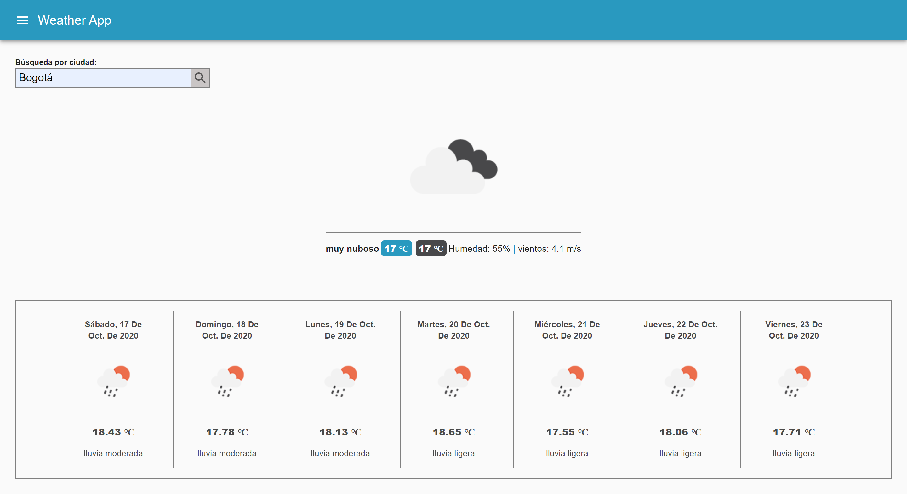
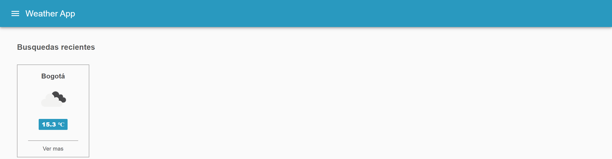

# App de Clima

App de Clima integrada con el API de [https://openweathermap.org/api](https://openweathermap.org/api).

[Ver la aplicación en https://clima-react.georgerangelcode.vercel.app/](https://clima-react.georgerangelcode.vercel.app/)

## ¿Cómo funciona?

Requiere Node.JS > 10

* `npm install` para instalar las dependencias
* `npm run start` para iniciar el entorno de desarrollo
* `npm run build` para generar app para entorno de producción

## Licencia

MIT